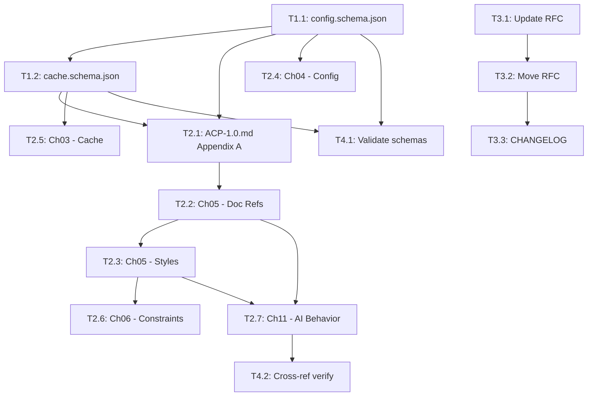

# Implementation Plan: RFC-0002 Documentation References and Style Guides

**Created**: 2025-12-22
**RFC**: `rfcs/proposed/rfc-0002-documentation-references-and-style-guides.md`
**Analysis**: `.claude/memory/rfc-analysis-0002.md`

---

## Overview

This plan implements RFC-0002, which formalizes the `@acp:ref` and `@acp:style` annotation system with project-level configuration, schema support, and AI behavioral guidelines.

### Goals

1. Add `documentation` configuration section to config schema
2. Extend cache schema with `refs[]` and enhanced `style` support
3. Update specification with new annotations and behaviors
4. Document AI behavior for reference handling

### Scope

| In Scope | Out of Scope |
|----------|--------------|
| Spec updates (ACP-1.0.md, chapters) | CLI implementation (separate repo) |
| Schema updates (config, cache) | MCP server changes (separate repo) |
| RFC finalization | Documentation fetching library |
| Grammar additions | IDE integration |

### Prerequisites

- RFC-0001 (Self-Documenting Annotations) is already accepted and partially implemented
- Basic `@acp:ref` and `@acp:style` exist in current spec

---

## Phase 1: Schema Updates

**Goal**: Establish the data contract before spec updates

### T1.1: Update config.schema.json with documentation section

**Files**: `schemas/v1/config.schema.json`
**Estimated Time**: 1 hour
**Depends On**: None

Add the `documentation` object with:
- `approvedSources[]` - trusted documentation sources
- `styleGuides{}` - custom style guide definitions
- `defaults` - default documentation settings
- `validation` - reference validation settings

**Acceptance Criteria**:
- [ ] `documentation` property added to schema
- [ ] `$defs/approved_source` definition added
- [ ] `$defs/style_guide_definition` definition added
- [ ] All properties have descriptions
- [ ] Schema validates against JSON Schema Draft-07

---

### T1.2: Update cache.schema.json with refs and style

**Files**: `schemas/v1/cache.schema.json`
**Estimated Time**: 1.5 hours
**Depends On**: T1.1

Add to file_entry:
- `refs[]` - documentation references array
- Enhanced `style` object (not just string)

Add `$defs`:
- `ref_entry` - documentation reference entry
- `style_entry` - enhanced style configuration

Add top-level:
- `documentation` - project-wide documentation index

**Acceptance Criteria**:
- [ ] `refs` array added to `file_entry`
- [ ] `style` property in `file_entry` updated to object type
- [ ] `$defs/ref_entry` definition added
- [ ] `$defs/style_entry` definition added
- [ ] Top-level `documentation` property added
- [ ] Backward compatible (existing caches still valid)

---

## Phase 2: Specification Updates

**Goal**: Document the new annotations and behaviors

### T2.1: Update ACP-1.0.md Appendix A (Reserved Annotations)

**Files**: `spec/ACP-1.0.md`
**Estimated Time**: 45 minutes
**Depends On**: T1.1, T1.2

Add new annotations to reserved namespace table:
- `@acp:ref-version`
- `@acp:ref-section`
- `@acp:ref-fetch`
- `@acp:style-extends`

Update existing entries:
- `@acp:ref` - add source ID support
- `@acp:style` - add link to config style guides

**Acceptance Criteria**:
- [ ] All new annotations listed in Appendix A
- [ ] Syntax and examples provided
- [ ] Cross-references to detailed sections

---

### T2.2: Update Chapter 05 (Annotations) - Documentation References Section

**Files**: `spec/chapters/05-annotations.md`
**Estimated Time**: 1.5 hours
**Depends On**: T2.1

Add new section "5.X Documentation References":
- `@acp:ref` detailed specification
- `@acp:ref-version` specification
- `@acp:ref-section` specification
- `@acp:ref-fetch` specification
- Resolution order (config sources → direct URLs)
- Examples with approved sources

**Acceptance Criteria**:
- [ ] New section added with proper numbering
- [ ] EBNF grammar for each annotation
- [ ] Examples showing config source IDs
- [ ] Examples showing direct URLs
- [ ] Resolution order documented

---

### T2.3: Update Chapter 05 (Annotations) - Style Guides Section

**Files**: `spec/chapters/05-annotations.md`
**Estimated Time**: 1 hour
**Depends On**: T2.2

Update/add style guide content:
- `@acp:style-extends` specification
- Built-in style guide registry (table from RFC)
- Custom style guide configuration
- Style rule inheritance

**Acceptance Criteria**:
- [ ] `@acp:style-extends` documented
- [ ] Built-in style guide table added
- [ ] Custom guide configuration explained
- [ ] Inheritance rules documented

---

### T2.4: Update Chapter 04 (Config Format)

**Files**: `spec/chapters/04-config-format.md`
**Estimated Time**: 1 hour
**Depends On**: T1.1

Add documentation configuration section:
- `documentation.approvedSources[]` format
- `documentation.styleGuides{}` format
- `documentation.defaults` options
- `documentation.validation` options
- Complete examples

**Acceptance Criteria**:
- [ ] New section for documentation config
- [ ] All properties documented
- [ ] JSON examples provided
- [ ] Cross-references to Chapter 05

---

### T2.5: Update Chapter 03 (Cache Format)

**Files**: `spec/chapters/03-cache-format.md`
**Estimated Time**: 45 minutes
**Depends On**: T1.2

Document new cache fields:
- `files[path].refs[]` structure
- `files[path].style` enhanced structure
- Top-level `documentation` index

**Acceptance Criteria**:
- [ ] `refs` array documented in file entry
- [ ] `style` object structure documented
- [ ] `documentation` index documented
- [ ] JSON examples provided

---

### T2.6: Update Chapter 06 (Constraints) - Style Constraints

**Files**: `spec/chapters/06-constraints.md`
**Estimated Time**: 30 minutes
**Depends On**: T2.3

Update style constraint section:
- Link to style guide definitions
- Inheritance from config defaults
- Override precedence (symbol > file > config)

**Acceptance Criteria**:
- [ ] Style constraint section updated
- [ ] Precedence rules documented
- [ ] Cross-reference to Chapter 05

---

### T2.7: Add AI Behavior Specification

**Files**: `spec/chapters/11-tool-integration.md`
**Estimated Time**: 1 hour
**Depends On**: T2.2, T2.3

Add section on AI handling of documentation references:
- When to consult references (table from RFC)
- When NOT to fetch
- Style application behavior
- Reference resolution order

**Acceptance Criteria**:
- [ ] "Documentation References" section added
- [ ] Consultation guidelines table
- [ ] Style application table
- [ ] Resolution order documented
- [ ] SHOULD/MAY/MUST levels specified

---

## Phase 3: RFC Finalization

**Goal**: Complete RFC lifecycle

### T3.1: Update RFC with resolved open questions

**Files**: `rfcs/proposed/rfc-0002-documentation-references-and-style-guides.md`
**Estimated Time**: 20 minutes
**Depends On**: None (can parallel with Phase 1-2)

Resolve remaining open questions:
- Q3: Non-HTTP schemes → "Deferred to future RFC"
- Q4: Rate limiting → "Left to implementations with SHOULD-level guidance"

Add reference to RFC-0001 as foundation.

**Acceptance Criteria**:
- [ ] Open questions section updated
- [ ] RFC-0001 referenced
- [ ] Status updated to "Accepted"

---

### T3.2: Move RFC to accepted/

**Files**: Move `rfcs/proposed/rfc-0002-*.md` → `rfcs/accepted/`
**Estimated Time**: 5 minutes
**Depends On**: T3.1

**Acceptance Criteria**:
- [ ] RFC moved to accepted directory
- [ ] File renamed if needed

---

### T3.3: Update CHANGELOG

**Files**: `CHANGELOG.md`
**Estimated Time**: 15 minutes
**Depends On**: T3.2

Add entry for RFC-0002 implementation.

**Acceptance Criteria**:
- [ ] New version section added
- [ ] All changes listed
- [ ] Links to RFC and relevant sections

---

## Phase 4: Validation

**Goal**: Ensure correctness and completeness

### T4.1: Validate schemas

**Files**: All schema files
**Estimated Time**: 30 minutes
**Depends On**: T1.1, T1.2

Run schema validation:
- Schemas are valid JSON Schema Draft-07
- No circular references
- All $refs resolve

**Acceptance Criteria**:
- [ ] config.schema.json validates
- [ ] cache.schema.json validates
- [ ] Test fixtures pass validation

---

### T4.2: Cross-reference verification

**Files**: All spec chapters
**Estimated Time**: 30 minutes
**Depends On**: T2.1-T2.7

Verify all cross-references:
- Chapter links work
- Schema references match
- No broken links

**Acceptance Criteria**:
- [ ] All internal links verified
- [ ] Schema references accurate
- [ ] No orphaned sections

---

## Dependencies Graph

---

## Effort Summary

| Phase | Tasks | Estimated Time |
|-------|-------|----------------|
| Phase 1: Schemas | 2 | 2.5 hours |
| Phase 2: Spec | 7 | 6.5 hours |
| Phase 3: RFC | 3 | 40 minutes |
| Phase 4: Validation | 2 | 1 hour |
| **Total** | **14** | **~10.5 hours** |

---

## Risk Mitigation

| Risk | Likelihood | Impact | Mitigation |
|------|------------|--------|------------|
| Schema backward compat | Low | High | All new fields optional with defaults |
| Cross-reference errors | Medium | Low | Automated link checking in validation |
| Incomplete coverage | Low | Medium | Checklist-based verification |
| Spec inconsistency | Low | Medium | Cross-reference pass in Phase 4 |

---

## Success Criteria

RFC-0002 is fully implemented when:

1. **Schemas**:
   - [ ] config.schema.json has `documentation` section
   - [ ] cache.schema.json has `refs[]`, enhanced `style`, and `documentation` index
   - [ ] Both schemas validate

2. **Specification**:
   - [ ] ACP-1.0.md Appendix A updated
   - [ ] Chapter 03 documents cache additions
   - [ ] Chapter 04 documents config additions
   - [ ] Chapter 05 has documentation reference section
   - [ ] Chapter 05 has updated style guide section
   - [ ] Chapter 06 updated for style constraints
   - [ ] Chapter 11 has AI behavior section

3. **RFC Lifecycle**:
   - [ ] RFC moved to accepted/
   - [ ] CHANGELOG updated
   - [ ] Open questions resolved

---

## Handoff for /rfc.implement

**Plan Path**: `.claude/memory/rfc-plan-0002.md`
**Tasks Path**: `.claude/memory/rfc-tasks-0002.md`
**Start Phase**: Phase 1 (Schemas)

**Recommended Order**:
1. T1.1 → T1.2 (schemas first)
2. T2.1 (spec foundation)
3. T2.2, T2.3, T2.4, T2.5, T2.6, T2.7 (spec chapters - can partially parallel)
4. T3.1 → T3.2 → T3.3 (RFC lifecycle)
5. T4.1, T4.2 (validation)

**No blockers identified.**

---

*Plan created: 2025-12-22*
