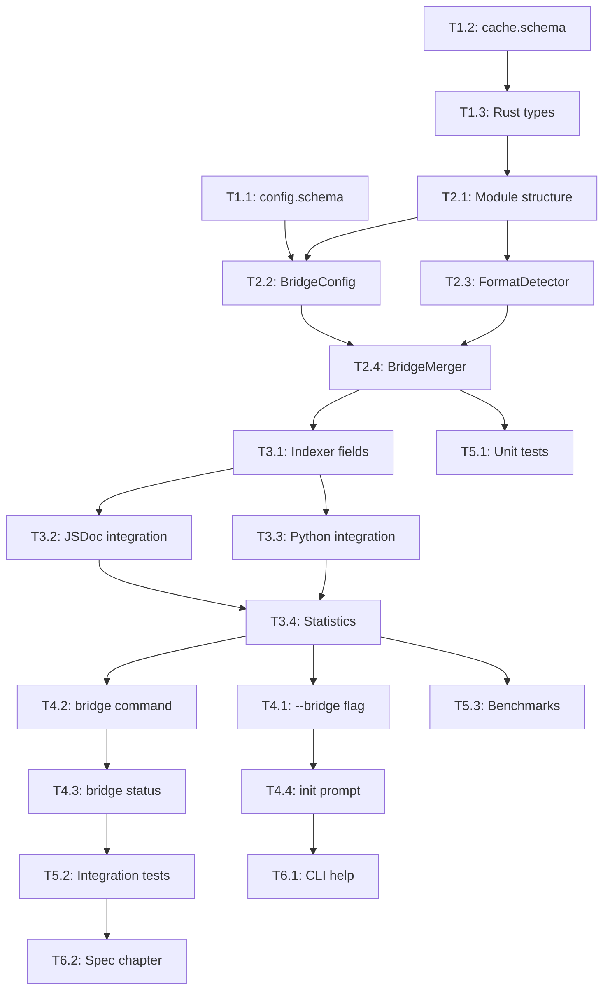

# Implementation Plan: RFC-0006 Documentation System Bridging

**RFC**: RFC-0006
**Title**: Documentation System Bridging
**Status**: Accepted
**Created**: 2025-12-23
**Target**: ACP CLI v1.3.0+

---

## Overview

RFC-0006 implements a documentation bridging system that extracts and reuses existing documentation from JSDoc, Python docstrings, and other language-specific systems, integrating them into the ACP cache during indexing.

### Goals

1. Eliminate documentation duplication between native docs and ACP annotations
2. Leverage existing 5,691 lines of converters in `src/annotate/converters/`
3. Implement precedence rules for merging native docs with ACP annotations
4. Add configuration for per-language bridging control
5. Provide CLI commands for bridging status and validation

### Key Decisions

| Decision | Resolution |
|----------|------------|
| Default bridging | Disabled; prompt during `acp init` |
| Malformed docs | Configurable strictness (`permissive` default) |
| Custom formats | Deferred to RFC-0007 |
| Type extraction | Simple types first; complex in Phase 4 |
| Performance target | < 15% indexing overhead |

---

## Component Analysis

### Affected Components

| Component | Type | Priority | Effort |
|-----------|------|----------|--------|
| `schemas/v1/config.schema.json` | Modify | P0 | 1h |
| `schemas/v1/cache.schema.json` | Modify | P0 | 1h |
| `cli/src/bridge/` | New module | P0 | 6h |
| `cli/src/index/indexer.rs` | Modify | P0 | 3h |
| `cli/src/commands/init.rs` | Modify | P1 | 1h |
| `cli/src/commands/bridge.rs` | New file | P1 | 3h |
| `cli/src/main.rs` | Modify | P1 | 30m |
| `spec/chapters/XX-bridging.md` | New chapter | P2 | 2h |
| `cli/tests/bridge_tests.rs` | New file | P1 | 4h |

### Existing Infrastructure

The following converters already exist and will be reused:

| Converter | Location | Lines | Status |
|-----------|----------|-------|--------|
| JSDoc/TSDoc | `src/annotate/converters/jsdoc.rs` | 1,086 | Ready |
| Python docstrings | `src/annotate/converters/docstring.rs` | 1,642 | Ready |
| Rust doc | `src/annotate/converters/rustdoc.rs` | 904 | Phase 3 |
| Go doc | `src/annotate/converters/godoc.rs` | 754 | Phase 3 |
| Javadoc | `src/annotate/converters/javadoc.rs` | 977 | Phase 3 |
| Base trait | `src/annotate/converters/mod.rs` | 328 | Ready |

---

## Phase 1: Foundation (Spec & Schema)

**Purpose**: Establish the contract before implementation
**Estimated Time**: 3-4 hours
**Gate**: Schemas compile and validate

### T1.1: Update config.schema.json

**Component**: schemas
**File**: `schemas/v1/config.schema.json`
**Depends On**: None
**Estimated Time**: 1h

**Description**:
Add the `bridge` configuration section to the config schema.

**Changes**:
```json
{
  "bridge": {
    "type": "object",
    "description": "Documentation bridging configuration",
    "properties": {
      "enabled": {
        "type": "boolean",
        "default": false,
        "description": "Enable documentation bridging during indexing"
      },
      "precedence": {
        "type": "string",
        "enum": ["acp-first", "native-first", "merge"],
        "default": "acp-first",
        "description": "Precedence when both native docs and ACP exist"
      },
      "strictness": {
        "type": "string",
        "enum": ["permissive", "strict"],
        "default": "permissive",
        "description": "How to handle malformed documentation"
      },
      "jsdoc": {
        "type": "object",
        "properties": {
          "enabled": { "type": "boolean", "default": true }
        }
      },
      "python": {
        "type": "object",
        "properties": {
          "enabled": { "type": "boolean", "default": true },
          "docstringStyle": {
            "type": "string",
            "enum": ["auto", "google", "numpy", "sphinx"],
            "default": "auto"
          }
        }
      }
    }
  }
}
```

**Acceptance Criteria**:
- [ ] Schema validates successfully
- [ ] Default values match RFC decisions
- [ ] All three precedence modes defined

### T1.2: Update cache.schema.json

**Component**: schemas
**File**: `schemas/v1/cache.schema.json`
**Depends On**: None
**Estimated Time**: 1h

**Description**:
Add bridging provenance fields to cache schema.

**Changes**:
1. Add `typeSource` to param_entry
2. Add `source` enum to param_entry (explicit/converted/merged)
3. Add `sourceFormat` string field
4. Add `sourceFormats` array for merged entries
5. Add `bridge_metadata` to file_entry and symbol_entry

**Acceptance Criteria**:
- [ ] Schema validates successfully
- [ ] Existing caches remain valid (additive only)
- [ ] All provenance fields optional with defaults

### T1.3: Update Rust cache types

**Component**: cli
**File**: `cli/src/cache/types.rs`
**Depends On**: T1.2
**Estimated Time**: 1h

**Description**:
Add Rust types to match cache schema additions.

**Changes**:
```rust
#[derive(Debug, Clone, Serialize, Deserialize)]
pub struct BridgeMetadata {
    pub enabled: bool,
    pub detected_style: Option<String>,
    pub converted_count: u32,
    pub merged_count: u32,
    pub explicit_count: u32,
}

// Add to SymbolEntry
pub bridge_source: Option<String>,
pub bridge_sources: Option<Vec<String>>,
pub type_source: Option<String>,
```

**Acceptance Criteria**:
- [ ] Types compile without errors
- [ ] Serde serialization works correctly
- [ ] Optional fields serialize as expected

---

## Phase 2: Bridge Module

**Purpose**: Core bridging logic
**Estimated Time**: 6-8 hours
**Gate**: Bridge module compiles, unit tests pass

### T2.1: Create bridge module structure

**Component**: cli
**Files**: `cli/src/bridge/mod.rs`
**Depends On**: T1.3
**Estimated Time**: 30m

**Description**:
Create the bridge module structure and exports.

**Changes**:
```rust
//! @acp:module "Bridge"
//! @acp:summary "Documentation bridging system (RFC-0006)"
//! @acp:domain cli
//! @acp:layer service

pub mod config;
pub mod merger;
pub mod detector;

pub use config::BridgeConfig;
pub use merger::{BridgeMerger, MergeResult};
pub use detector::FormatDetector;
```

**Acceptance Criteria**:
- [ ] Module compiles
- [ ] Exports are accessible from lib.rs

### T2.2: Implement BridgeConfig

**Component**: cli
**File**: `cli/src/bridge/config.rs`
**Depends On**: T2.1
**Estimated Time**: 1h

**Description**:
Configuration loading and validation for bridging.

**Changes**:
```rust
#[derive(Debug, Clone, Default)]
pub struct BridgeConfig {
    pub enabled: bool,
    pub precedence: Precedence,
    pub strictness: Strictness,
    pub jsdoc: LanguageConfig,
    pub python: PythonConfig,
}

#[derive(Debug, Clone, Copy, Default)]
pub enum Precedence {
    #[default]
    AcpFirst,
    NativeFirst,
    Merge,
}

impl BridgeConfig {
    pub fn from_config(config: &Config) -> Self;
    pub fn is_language_enabled(&self, lang: Language) -> bool;
}
```

**Acceptance Criteria**:
- [ ] Loads from Config correctly
- [ ] Defaults match schema defaults
- [ ] Language enable checks work

### T2.3: Implement FormatDetector

**Component**: cli
**File**: `cli/src/bridge/detector.rs`
**Depends On**: T2.1
**Estimated Time**: 1.5h

**Description**:
Detect Python docstring format from content.

**Changes**:
```rust
pub struct FormatDetector;

impl FormatDetector {
    /// Detect docstring style from content
    pub fn detect_docstring_style(content: &str) -> DocstringStyle;

    /// Detect if file has doc blocks worth parsing
    pub fn has_doc_blocks(content: &str, language: Language) -> bool;
}

pub enum DocstringStyle {
    Google,
    NumPy,
    Sphinx,
    Unknown,
}
```

**Acceptance Criteria**:
- [ ] Correctly identifies Google style
- [ ] Correctly identifies NumPy style
- [ ] Correctly identifies Sphinx style
- [ ] Returns Unknown for ambiguous

### T2.4: Implement BridgeMerger

**Component**: cli
**File**: `cli/src/bridge/merger.rs`
**Depends On**: T2.2, T2.3
**Estimated Time**: 3h

**Description**:
Merge native documentation with ACP annotations using precedence rules.

**Changes**:
```rust
pub struct BridgeMerger {
    config: BridgeConfig,
}

impl BridgeMerger {
    pub fn new(config: BridgeConfig) -> Self;

    /// Merge native docs with existing ACP annotations
    pub fn merge(
        &self,
        native: &ParsedDocumentation,
        acp: &[Annotation],
        target: &str,
    ) -> MergeResult;
}

pub struct MergeResult {
    pub annotations: Vec<AnnotationWithProvenance>,
    pub bridge_metadata: BridgeMetadata,
}
```

**Acceptance Criteria**:
- [ ] acp-first mode works correctly
- [ ] native-first mode works correctly
- [ ] merge mode concatenates properly
- [ ] Provenance tracked for each annotation

---

## Phase 3: Indexer Integration

**Purpose**: Wire bridging into indexing pipeline
**Estimated Time**: 4-5 hours
**Gate**: `acp index --bridge` works on test projects

### T3.1: Add bridge to Indexer struct

**Component**: cli
**File**: `cli/src/index/indexer.rs`
**Depends On**: T2.4
**Estimated Time**: 1h

**Description**:
Add BridgeConfig and BridgeMerger to Indexer.

**Changes**:
```rust
pub struct Indexer {
    config: Config,
    parser: Arc<Parser>,
    ast_parser: Arc<AstParser>,
    bridge_config: BridgeConfig,  // NEW
    bridge_merger: BridgeMerger,  // NEW
}
```

**Acceptance Criteria**:
- [ ] Indexer compiles with new fields
- [ ] Bridge disabled when config says so

### T3.2: Integrate JSDoc bridging

**Component**: cli
**File**: `cli/src/index/indexer.rs`
**Depends On**: T3.1
**Estimated Time**: 1.5h

**Description**:
Call JSDoc converter during JS/TS file indexing.

**Changes**:
1. For JS/TS files, extract doc comments
2. Parse with `JsDocParser`
3. Call `bridge_merger.merge()` with results
4. Store merged annotations with provenance

**Acceptance Criteria**:
- [ ] JSDoc `@param` converted to cache
- [ ] JSDoc `@returns` converted to cache
- [ ] Existing ACP annotations preserved
- [ ] Provenance correctly tracked

### T3.3: Integrate Python docstring bridging

**Component**: cli
**File**: `cli/src/index/indexer.rs`
**Depends On**: T3.1
**Estimated Time**: 1.5h

**Description**:
Call docstring converter during Python file indexing.

**Changes**:
1. Detect docstring style (or use config)
2. Parse with `DocstringParser`
3. Call `bridge_merger.merge()` with results
4. Store merged annotations with provenance

**Acceptance Criteria**:
- [ ] Google docstring Args: converted
- [ ] Google docstring Returns: converted
- [ ] Existing ACP annotations preserved
- [ ] Style detection works

### T3.4: Track bridge statistics

**Component**: cli
**File**: `cli/src/index/indexer.rs`
**Depends On**: T3.2, T3.3
**Estimated Time**: 1h

**Description**:
Aggregate bridging statistics into cache.

**Changes**:
1. Count converted vs merged vs explicit
2. Track by language/format
3. Store in cache.bridge_metadata

**Acceptance Criteria**:
- [ ] Stats accurate for test project
- [ ] Stats in cache JSON output
- [ ] Per-file stats available

---

## Phase 4: CLI Commands

**Purpose**: User-facing commands
**Estimated Time**: 4-5 hours
**Gate**: All commands work end-to-end

### T4.1: Add --bridge flag to index command

**Component**: cli
**Files**: `cli/src/main.rs`, `cli/src/commands/index.rs`
**Depends On**: T3.4
**Estimated Time**: 30m

**Description**:
Add `--bridge` / `--no-bridge` flags to `acp index`.

**Acceptance Criteria**:
- [ ] Flags parse correctly
- [ ] Override config setting
- [ ] Help text accurate

### T4.2: Create bridge command

**Component**: cli
**File**: `cli/src/commands/bridge.rs`
**Depends On**: T3.4
**Estimated Time**: 1h

**Description**:
Create `acp bridge` command with subcommands.

**Changes**:
```rust
pub enum BridgeSubcommand {
    Status,
    // Lint and Convert deferred to Phase 2/3
}

pub fn execute_bridge(subcommand: BridgeSubcommand) -> Result<()>;
```

**Acceptance Criteria**:
- [ ] `acp bridge status` works
- [ ] Command registered in main.rs

### T4.3: Implement bridge status command

**Component**: cli
**File**: `cli/src/commands/bridge.rs`
**Depends On**: T4.2
**Estimated Time**: 1.5h

**Description**:
Show bridging statistics and configuration.

**Output**:
```
Bridge Status
=============

Configuration:
  Enabled: true
  Precedence: acp-first
  Strictness: permissive

Languages:
  JSDoc: enabled
  Python: enabled (style: auto-detect)

Statistics (from cache):
  Total annotations: 847
    Explicit (ACP only): 234 (28%)
    Converted (from native): 412 (49%)
    Merged (ACP + native): 156 (18%)

  By format:
    JSDoc: 312
    Google docstring: 187
```

**Acceptance Criteria**:
- [ ] Shows config correctly
- [ ] Shows statistics from cache
- [ ] Works with --json flag

### T4.4: Update acp init for bridging

**Component**: cli
**File**: `cli/src/commands/init.rs`
**Depends On**: T4.1
**Estimated Time**: 1h

**Description**:
Add bridging prompt to `acp init`.

**Changes**:
1. Add prompt: "Enable documentation bridging?"
2. Explain what bridging does
3. If yes, prompt for precedence mode
4. Write to config

**Acceptance Criteria**:
- [ ] Prompt shows during init
- [ ] Explanation is clear
- [ ] Config saved correctly
- [ ] --yes flag works

---

## Phase 5: Testing

**Purpose**: Ensure correctness
**Estimated Time**: 5-6 hours
**Gate**: All tests pass, coverage > 80%

### T5.1: Unit tests for bridge module

**Component**: cli
**File**: `cli/src/bridge/mod.rs` (inline tests)
**Depends On**: T2.4
**Estimated Time**: 2h

**Tests**:
- FormatDetector: Google, NumPy, Sphinx, Unknown
- BridgeConfig: loading, defaults
- BridgeMerger: all three precedence modes
- Edge cases: empty docs, malformed docs

**Acceptance Criteria**:
- [ ] 15+ unit tests
- [ ] All pass

### T5.2: Integration tests

**Component**: cli
**File**: `cli/tests/bridge_tests.rs`
**Depends On**: T4.3
**Estimated Time**: 3h

**Tests**:
- JSDoc file → correct cache output
- Python file → correct cache output
- Mixed ACP + JSDoc → correct merge
- Bridge disabled → no conversion
- --bridge / --no-bridge flags

**Acceptance Criteria**:
- [ ] 10+ integration tests
- [ ] All pass

### T5.3: Performance benchmarks

**Component**: cli
**File**: `cli/benches/bridge_bench.rs`
**Depends On**: T3.4
**Estimated Time**: 1h

**Benchmarks**:
- Index with bridge disabled (baseline)
- Index with bridge enabled
- Per-file parsing time

**Acceptance Criteria**:
- [ ] < 15% overhead documented
- [ ] Benchmark reproducible

---

## Phase 6: Documentation

**Purpose**: Enable users
**Estimated Time**: 2-3 hours
**Gate**: Docs reviewed and accurate

### T6.1: Update CLI help text

**Component**: cli
**Files**: `cli/src/main.rs`
**Depends On**: T4.4
**Estimated Time**: 30m

**Acceptance Criteria**:
- [ ] --bridge flag documented
- [ ] `acp bridge` command documented

### T6.2: Create bridging spec chapter

**Component**: spec
**File**: `spec/chapters/15-bridging.md`
**Depends On**: T5.2
**Estimated Time**: 2h

**Sections**:
1. Overview
2. Configuration
3. Precedence Rules
4. Supported Formats
5. Examples

**Acceptance Criteria**:
- [ ] All features documented
- [ ] Examples accurate

---

## Dependencies

### Task Dependency Graph



### Critical Path

1. T1.1 → T2.2 → T2.4 → T3.1 → T3.2 → T3.4 → T4.3 → T5.2

**Minimum time to functional MVP**: ~12 hours

---

## Risk Mitigation

| Risk | Likelihood | Impact | Mitigation |
|------|------------|--------|------------|
| Performance regression | Medium | High | Benchmark early (T5.3), lazy parsing |
| Merge logic complexity | Medium | Medium | Start with acp-first only, expand |
| Converter bugs | Low | Medium | Converters already tested in annotate |
| Format detection errors | Medium | Low | Allow manual override via config |

---

## Success Criteria

### Phase 1 (MVP) Complete When:
- [ ] `acp index --bridge` produces correct cache
- [ ] JSDoc params/returns in cache with provenance
- [ ] Python docstring Args/Returns in cache
- [ ] `acp bridge status` shows statistics
- [ ] `acp init` prompts for bridging
- [ ] Performance < 15% overhead
- [ ] All tests pass

### Full Implementation Complete When:
- [ ] All Phase 1 criteria met
- [ ] Spec chapter written
- [ ] CLI help updated
- [ ] Integration tests comprehensive

---

## Effort Summary

| Phase | Tasks | Estimated Hours |
|-------|-------|-----------------|
| Phase 1: Foundation | T1.1-T1.3 | 3h |
| Phase 2: Bridge Module | T2.1-T2.4 | 6h |
| Phase 3: Indexer | T3.1-T3.4 | 5h |
| Phase 4: CLI | T4.1-T4.4 | 4h |
| Phase 5: Testing | T5.1-T5.3 | 6h |
| Phase 6: Docs | T6.1-T6.2 | 2.5h |
| **Total** | **19 tasks** | **26.5h** |

---

## Handoff to /rfc.implement

```
RFC-0006 plan is ready for implementation.
Plan: .claude/memory/rfc-plan-0006.md
Tasks: .claude/memory/rfc-tasks-0006.md

Start with Phase 1: Foundation
- T1.1: Update config.schema.json
- T1.2: Update cache.schema.json
- T1.3: Update Rust cache types

Critical path: T1.1 → T2.2 → T2.4 → T3.1 → T3.2 → T3.4 → T4.3

No blockers. Estimated total: 26.5 hours.

Ready for /rfc.implement
```
